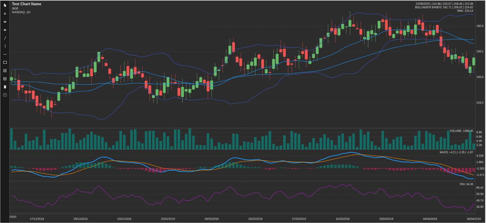
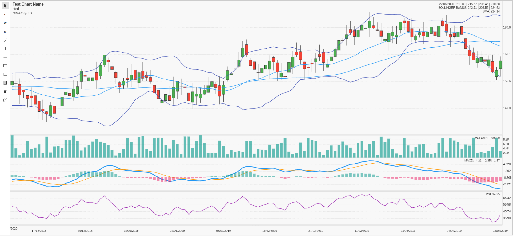

# [AI Stock View](https://aistockview.com) Chart

An interactive stock charting library supporting candlestick and line charts, multiple plots, crosshair synchronization, overlays for price and technical indicators, and light/dark themes.

## Features

- 📈 Supports candlestick and line charts
- 🖱️ Crosshair cursor with synchronization across multiple charts
- 🔍 Interactive zooming and panning
- 🎨 Light and dark themes
- 📊 Overlay layer for price details and technical indicators
- 📐 Responsive design with automatic resizing
- 📦 Lightweight and optimized main chart bundle
- 📆 Daily, Weekly, and Monthly timeframe selection
- ✏️ Drawing tools: line, vertical line, horizontal line, rectangle, Fibonacci retracement, and Fibonacci zone
- 🗑️ Ability to clear all drawings
- ⚙️ Settings panel for technical indicators
- 💾 Indicator settings are saved to local storage

## Demo

[Live](https://williamchh.github.io/ai-stock-view-chart/demo/)

## Screenshots

### Dark Mode


### Light Mode


## Installation

```bash
npm install ai-stock-view-chart
```

or using yarn:

```bash
yarn add ai-stock-view-chart
```

## Usage

Include the library and create a chart:

```html
<div id="chart-container" style="width:800px;height:400px;"></div>
<script type="module">
  import StockChart from 'ai-stock-view-chart';

  // Example data
  const candlestickData = [
    { time: 1672531200, open: 100, high: 110, low: 95, close: 105, volume: 5000 },
    { time: 1672617600, open: 105, high: 115, low: 100, close: 110, volume: 6000 },
    // ... more data points
  ];

  const volumeData = candlestickData.map(d => ({ time: d.time, volume: d.volume }));

  StockChart.init('chart-container', {
    theme: 'light',
    initialVisibleCandles: 50,
    plots: [
      {
        id: 'main',
        type: 'candlestick',
        heightRatio: 0.7,
        data: candlestickData,
      },
      {
        id: 'volume',
        type: 'volume',
        heightRatio: 0.3,
        data: volumeData,
      }
    ]
  });
</script>
```

## Development

To run the demo app locally, you can use a simple HTTP server.

1.  **Install dependencies**

    If you haven't already, install the development dependencies:

    ```bash
    npm install
    ```

2.  **Start the server**

    From the root of the project, run the following command:

    ```bash
    npm start
    ```

    This uses the `serve` package to host the project.

2.  **Open the demo**

    Once the server is running, open your browser and navigate to the [`demo/index.html`](demo/index.html) page (e.g., `http://localhost:3000/demo/`).

## API

### StockChart.init(elementId, options)

Initializes a new chart instance.

- `elementId` (string): The ID of the DOM element where the chart will be mounted.
- `options` (StockChartOptions): An object containing configuration options for the chart.

#### StockChartOptions

| Option                  | Type                                | Default                               | Description                                                                                                                                          |
| ----------------------- | ----------------------------------- | ------------------------------------- | ---------------------------------------------------------------------------------------------------------------------------------------------------- |
| `theme`                 | `'light'` \| `'dark'`               | `'light'`                             | Sets the color theme for the chart.                                                                                                                  |
| `chartName`             | `ChartName`                         | `undefined`                           | An object to display the name, code, and other metadata on the chart.                                                                                |
| `initialVisibleCandles` | `number`                            | `100`                                 | The number of data points (e.g., candlesticks) to display when the chart is first loaded.                                                            |
| `plots`                 | `Array<PlotConfig>`                 | `[{ id: 'main', ... }]`               | An array of plot configurations that define the different sections of the chart (e.g., price, volume, indicators).                                   |
| `showDrawingToolbar`    | `boolean`                           | `true`                                | Controls the visibility of the drawing toolbar.                                                                                                      |
| `showTimeframeButtons`  | `boolean`                           | `true`                                | Controls the visibility of the timeframe selection buttons.                                                                                          |

#### ChartName

| Property     | Type     | Description                               |
| ------------ | -------- | ----------------------------------------- |
| `name`       | `string` | The main name or title (e.g., "Apple ").  |
| `code`       | `string` | The ticker or symbol (e.g., "AAPL").      |
| `metaString` | `string` | Additional info (e.g., "NASDAQ, 1D").     |

#### PlotStyle

| Property        | Type     | Description                                                              |
| --------------- | -------- | ------------------------------------------------------------------------ |
| `lineColor`     | `string` | Color for line charts.                                                   |
| `lineWidth`     | `number` | Width for line charts.                                                   |
| `positiveColor` | `string` | Color for positive values in a histogram.                                |
| `negativeColor` | `string` | Color for negative values in a histogram.                                |

## License

MIT © 2025 [AI Stock View](https://aistockview.com/) 